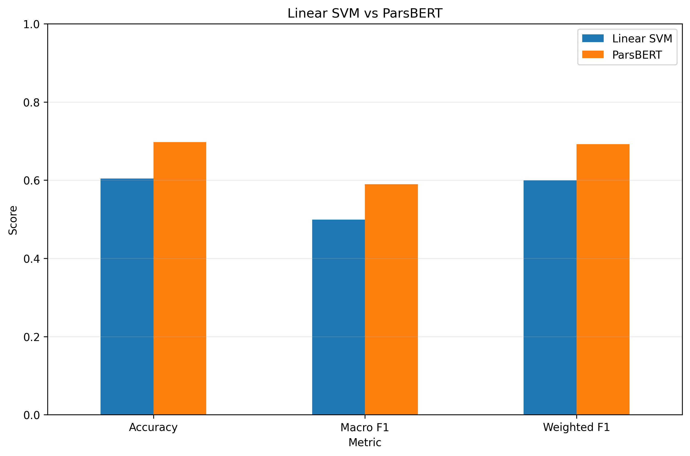
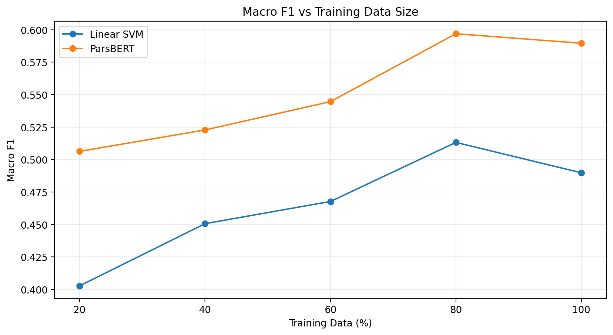
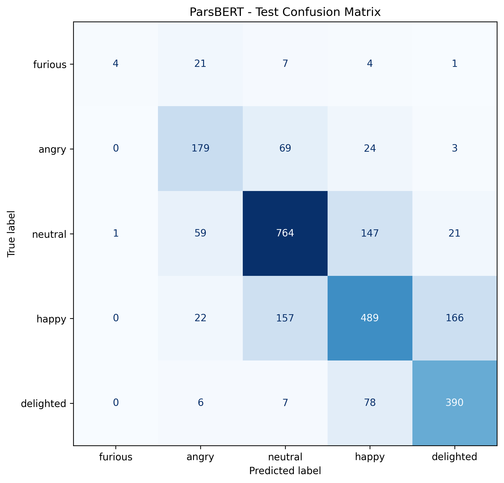

# Persian Sentiment Analysis

Persian sentiment analysis using the **SentiPers** dataset and comparing classical machine learning approaches with the **ParsBERT** Transformer model.

## Project Goal

The main objective of this project is to evaluate different classification approaches for five-class Persian sentiment analysis and compare classical machine learning models with a Transformer-based model.

## Notebook Reports

The project includes both Jupyter Notebook files for reproducibility and rendered HTML reports for easier reading and visualization.

The HTML versions contain the complete notebook outputs and visual presentation, while the `.ipynb` files provide the original executable workflows.

### Available Reports

- [01 - Data Audit Report](notebooks/01_data_audit.html)
- [02 - Data Cleaning Report](notebooks/02_data_cleaning.html)
- [03 - Classical Machine Learning Models Report](notebooks/03_classic_models.html)
- [04 - ParsBERT Fine-tuning Report](notebooks/04_parsbert.html)
- [05 - Extended Analysis Report](notebooks/05_extended_analysis.html)

## Results Visualization

### Model Comparison



### Learning Curve Comparison



Sentiment classes:

* `furious`
* `angry`
* `neutral`
* `happy`
* `delighted`

## Notebook Structure

The project is implemented through five main notebooks.

### 01 — Data Audit

`01_data_audit.ipynb`

Initial dataset inspection including:

* Dataset structure
* Missing values
* Duplicate samples
* Label conflicts
* Text length analysis
* Class distribution

### 02 — Data Cleaning

`02_data_cleaning.ipynb`

Includes:

* Persian text normalization
* Removing duplicate samples
* Removing samples with conflicting labels
* Creating the final cleaned dataset version

Final number of samples:

**13,094**

### 03 — Classical Models

`03_classic_models.ipynb`

The evaluated classical models:

* Dummy Classifier
* Multinomial Naive Bayes
* Logistic Regression
* Linear SVM
* SGD Classifier

Text representation is performed using **TF-IDF**.

Best classical model:

**Linear SVM**

Final Linear SVM results:

| Metric      |  Value |
| ----------- | -----: |
| Accuracy    | 0.6040 |
| Macro F1    | 0.4987 |
| Weighted F1 | 0.5993 |

### 04 — ParsBERT

`04_parsbert.ipynb`

Model used:

`HooshvareLab/ber-parsbert-uncased`

Main stages:

* Tokenization
* Token length analysis
* `[UNK]` analysis
* Fine-tuning
* Evaluation on Test Set
* Confusion Matrix analysis
* Comparison with Linear SVM
* Comparative error analysis
* McNemar statistical test

Dataset split:

| Split      | Samples |
| ---------- | ------: |
| Train      |   9,165 |
| Validation |   1,310 |
| Test       |   2,619 |

Final ParsBERT results:

| Metric      |  Value |
| ----------- | -----: |
| Accuracy    | 0.6972 |
| Macro F1    | 0.5896 |
| Weighted F1 | 0.6920 |

ParsBERT achieved an absolute improvement of **0.0909** and a relative improvement of approximately **18.22%** in Macro F1 compared with Linear SVM.

### 05 — Extended Analysis

`05_extended_analysis.ipynb`

This notebook includes additional analysis:

* Detailed analysis of ParsBERT Confusion Matrix
* Identifying the most frequent class confusions
* Manual review of 20 ParsBERT error samples
* Creating training subsets with 20%, 40%, 60%, 80%, and 100% of data
* Plotting Learning Curves for Linear SVM
* Plotting Learning Curves for ParsBERT
* Comparing Macro F1 performance of both models with different training sizes

## Learning Curve

### Linear SVM

| Training Data | Macro F1 |
| ------------: | -------: |
|           20% |   0.4027 |
|           40% |   0.4506 |
|           60% |   0.4677 |
|           80% |   0.5132 |
|          100% |   0.4898 |

### ParsBERT

| Training Data | Macro F1 |
| ------------: | -------: |
|           20% |   0.5063 |
|           40% |   0.5228 |
|           60% |   0.5446 |
|           80% |   0.5969 |
|          100% |   0.5896 |

ParsBERT achieved higher Macro F1 values than Linear SVM across all evaluated training data sizes.

## Error Analysis

Analysis of ParsBERT errors showed that a significant portion of mistakes occurred between sentiment classes with similar emotional intensity.



The most frequent confusion patterns include:

* `happy → delighted`
* `delighted → happy`
* `happy → neutral`
* `neutral → happy`
* `angry → neutral`

Manual inspection showed that sentiment intensity ambiguity, descriptive sentences, and mixed emotions are among the important factors contributing to classification errors.

## Project Structure

```text
PersianSentimentProject/
│
├── data/
│ ├── interim/
│ └── processed/
│
├── notebooks/
│ ├── 01_data_audit.ipynb
│ ├── 02_data_cleaning.ipynb
│ ├── 03_classic_models.ipynb
│ ├── 04_parsbert.ipynb
│ ├── 05_extended_analysis.ipynb
│ │
│ ├── 01_data_audit.html
│ ├── 02_data_cleaning.html
│ ├── 03_classic_models.html
│ ├── 04_parsbert.html
│ └── 05_extended_analysis.html
│
├── outputs/
│ ├── plots/
│ ├── tables/
│ ├── 04_parsbert/
│ └── 05_extended_analysis/
│
├── requirements.txt
└── README.md
```

### notebooks

Contains the five main project notebooks.

### data

Contains raw data, intermediate data, and the cleaned SentiPers dataset.

### outputs

Contains:

* Metrics
* Predictions
* Tables
* Confusion Matrices
* Learning Curves
* Error Analysis
* Plots


### report

Rendered HTML notebook reports
Contains the final project report and images used in the report.

## Running the Project

The notebooks should be executed in the following order:


`01 → 02 → 03 → 04 → 05`

Using a GPU is recommended for ParsBERT training.

The main ParsBERT experiment was executed using an **NVIDIA Tesla T4 GPU**.

## ParsBERT Model Note

Fine-tuned model weights and training checkpoints are not included in the submitted version due to their large size.

The base ParsBERT model is automatically downloaded when running the notebook and can be fine-tuned again using the provided code.

## Overall Conclusion

The results show that ParsBERT achieved better performance than the best evaluated classical approach, Linear SVM, for five-class Persian sentiment analysis.

In addition to better performance on the main test set, ParsBERT also achieved higher Macro F1 values than Linear SVM across all evaluated training data sizes.

## Installation

``` bash
pip install -r requirements.txt
```

Run notebooks:

``` bash
jupyter notebook
```

Execute notebooks in order: 1. Data Audit 2. Data Cleaning 3. Classical
Models 4. ParsBERT Fine-tuning 5. Extended Analysis

## Dataset

The raw dataset is not included in this repository. It should be
prepared separately before running the notebooks.

## Technologies

-   Python
-   Pandas
-   NumPy
-   Scikit-learn
-   PyTorch
-   Hugging Face Transformers
-   ParsBERT
-   Jupyter Notebook

## License

This project is released for educational and research purposes.
